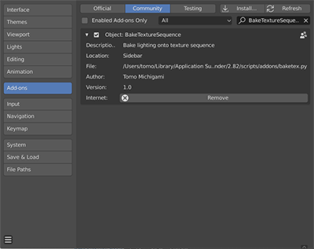
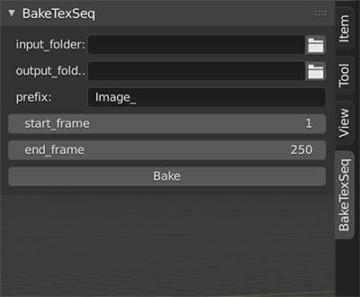
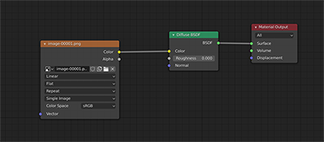

# BakeTextureSequence
This addon bake the lighting result onto texture image sequence from animated object.  
Tested with Blender2.8 or higher.  
Download latest release from here [BakeTextureSequnece](https://github.com/naritomo1984/BakeTextureSequence/releases/tag/v1.0)

Installation:  
Download "baketex.py" and go to "Edit" > "Preference" menu in Blender.  
In "Addon" tab, Click "Install" button and select py file.   
If it's successfully installed you can see the addon in addon list.  
  
Click check button to enable it.  
Addon UI will be appears in the right sidebar, under the view tab.

Usage:  
  
Input folder >>> the folder where the original image sequence is stored.  
Output folder  >>> the folder where the baked image sequnece will be stored.  
Prefix >>> Image sequence name. It must have one character or more. Also currently this addon   supports 5 zero padding sequence(#####.png).  
Start frame >>> Start frame of animation.
End frame >>> End frame of animation.  

  
In shader node editor add "DiffuseBSDF shader" and "Image texture node". Set the first texture of texture sequence in image texture node.(Currently this addon supports only DiffuseBSDF shader.  
Connect texture node output to color input of diffuse shader.  

Select the animated mesh and hit bake buttton.  
During baking Blender UI would be no responsing. I reccommend the open colsole window before hit  
bake button. So that you can check the current proccessing frame number.  

